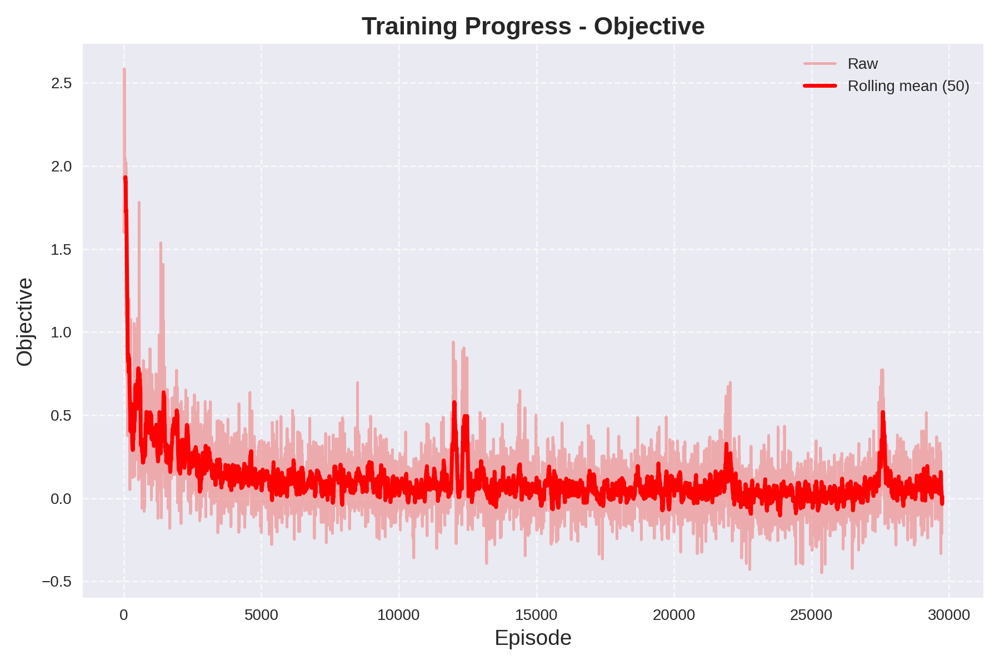
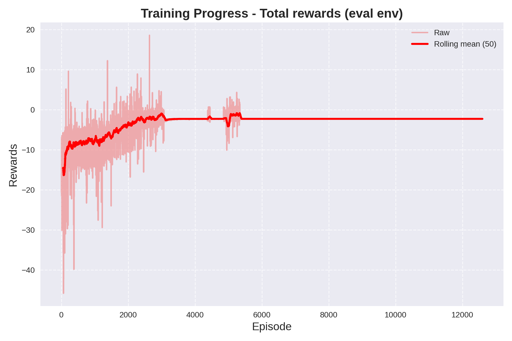
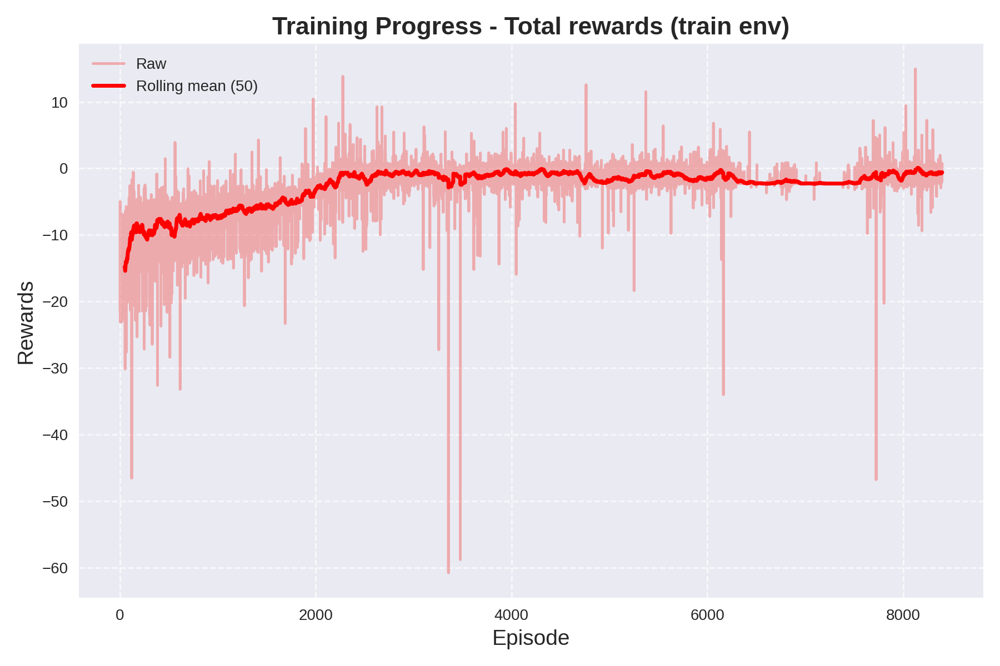

# ReinforceTrade — Reinforcement Learning for Market Microstructure

An end-to-end research codebase that preprocesses high-frequency market data, extracts high-volatility sessions, and trains a hybrid-action (discrete + continuous) LSTM-based PPO agent.
Designed for reproducible experiments, fast iteration, and scalable multi-ticker futures research.

---

## Overview

MarketRL provides:

- A **parallelized data preprocessing pipeline** for high-frequency market data
- A **technical-indicator feature engineering stack**
- A **volatility-based session extractor**
- A **hybrid-action PPO agent** with LSTM + GRU architecture
- Built-in **training, evaluation, and plotting utilities**

This repository is intended for research into market microstructure, algorithmic trading strategies, and reinforcement learning in continuous + discrete action environments.

---

## Key Features

### Data Pipeline

The pipeline is designed to transform raw OHLCV data into standardized, volatility-focused training sessions.

#### Collector
- Downloads 1/2/5-minute OHLCV data using `yfinance`
- Or loads pre-existing CSV datasets
- Automatically splits long periods into per-day queries
- Standardizes column names and datetime indexing

#### Preprocessor
- Forward-fills missing values
- Applies log-scaling for numerical stability
- Adds technical indicators:
  - Simple Moving Average (SMA)
  - Relative Strength Index (RSI)
  - MACD (MACD line, Signal, Histogram)
- Computes log-returns
- Drops incomplete rows after indicator windowing

#### Extractor
- Detects high-volatility windows using a configurable rolling window
- Extracts:
  - Pre-session context
  - High-volatility core window
  - Post-session continuation
- Filters false positives using scaled volatility thresholds

#### Scaler
- Per-ticker `StandardScaler`
- Automatically saved and reused for consistency between training and test data
- Prevents data leakage by fitting only on training intervals

#### Splitter
- Splits full datasets by trading day
- Randomly shuffles and creates train/test subsets

---

## Reinforcement Learning Algorithm

### PPO with Hybrid Actions

The agent implements **Proximal Policy Optimization (PPO)** with support for:
- **Discrete actions** (e.g. open / close / hold)
- **Continuous actions** (e.g. position size or leverage)

### Network Architecture

- Input: Sequence window of feature vectors (LSTM memory)
- Encoder:
  - Multi-layer LSTM
  - Followed by a multi-layer GRU
- Output heads:
  - Discrete logits (categorical policy)
  - Continuous mean and log-standard deviation (Gaussian policy)
  - Value estimate (critic network)

### Learning Features

- Generalized Advantage Estimation (GAE)
- PPO ratio clipping
- Entropy bonus for exploration
- Gradient norm clipping
- Mini-batch updates
- Multiple optimization epochs per update
- GPU support (automatic CUDA detection)

---

## Reward Function

The agent uses the reward provided by the environment at each step:
```bash
obs, reward, terminated, truncated, info = env.step((action_cont, action_disc))
```

### Expected Reward Design

The training logic assumes the reward represents **financial performance per step**, typically:

- Change in portfolio value (P&L)
- Minus transaction costs
- Minus slippage or spread
- Optional risk penalties

### Recommended Structure

A robust reward function usually includes:
- Profit and loss from open positions
- Commission or transaction fees
- Position holding cost
- Risk penalties (drawdown, leverage, or volatility exposure)

### Discounting

Returns are computed using:
- Discount factor: `gamma`
- Optional GAE smoothing: `lambda`

This allows the agent to balance short-term profit vs. long-term strategy stability.

---

## Market Environment Requirements

The training system expects a **Gymnasium-compatible environment** with the following structure:

### Observation Space
- 1D numerical feature vector per timestep
- Typically includes:
  - `log_close`
  - `log_high`
  - `log_low`
  - `log_volume`
  - `log_return`
  - SMA, RSI, MACD features
- LSTM memory window stacks the last `N` observations into a sequence

### Action Space

Hybrid format:

- Continuous:
  - Position size, leverage, or exposure
  - Range: (-1, 1), squashed by tanh
- Discrete:
  - Trading mode (e.g. Buy, Sell, Hold or Open, Close)

### Episode Termination

Episodes should end when:
- Dataset segment is exhausted
- Trading session ends
- Risk limits are breached
- Or a custom terminal condition is met

---

## Directory Structure

```text
.
├── data/
│ ├── tmp/ # Extracted raw volatility sessions
│ ├── scalers/ # Per-ticker StandardScaler objects
│ ├── train/ # Final training CSV files
│ ├── test/ # Final test CSV files
│ └── datasets/ # Optional raw datasets
├── src/
│    ├── models/
│   │ ├── neural_networks/
│   │ │ └── lstm.py
│   │ └── algorithms/
│   │   └── ppo.py
│   ├── plots/
│   │ ├── objective.png
│   │ ├── eval_rewards.png
│   │ └── train_rewards.png
│   ├── scripts/
│   │ └── train.py
│   ├── settings.py
│   └── main.py # To run preprocessing pipeline
├── requirements.txt
└── README.md
```

## Installation

Create a virtual environment and install dependencies:
```bash
pip install -r requirements.txt
```

Typical requirements:
- numpy
- pandas
- scikit-learn
- joblib
- tqdm
- yfinance
- gymnasium
- torch
- matplotlib

For GPU support, install a CUDA-compatible version of PyTorch.

---

## Data Processing Usage

### Download Market Data

```bash
from pipeline import download_data, load_dataset
download_data()
load_dataset()
```
This will:
- Download OHLCV data for all configured tickers
- Load tickers data from dataset in `./data/datasets`
- Extract volatility-based sessions
- Save processed train/test files

## Training Example

```bash
from algorithms import train
import gymnasium as gym

env = gym.make("YourMarketEnv-v0")
eval_env = gym.make("YourMarketEnv-v0")

mean_eval_reward = train(
env=env,
eval_env=eval_env,
total_steps=100000
)

print("Mean evaluation reward:", mean_eval_reward)
```

---

## Configuration Parameters

| Parameter | Description |
|----------|-------------|
| memory_size | LSTM window size |
| replay_buffer_size | Steps collected before training update |
| opt_epochs | PPO optimization passes per update |
| batch_size | Mini-batch size |
| clip_ratio | PPO clipping threshold |
| gamma | Reward discount factor |
| lam | GAE lambda |
| c1 | Value loss coefficient |
| c2 | Entropy bonus coefficient |
| grad_norm | Gradient clipping norm |
| sma_length | SMA indicator window |
| rsi_length | RSI indicator window |
| min_volatility | Volatility threshold for session extraction |

---

## Performance & Stability Tips

- Always fit scalers only on training data
- Enable `debug=True` to catch NaNs and exploding tensors
- Tune entropy coefficient `c2` to prevent premature policy collapse
- Lower `min_volatility` if no sessions are extracted
- Increase replay buffer size for more stable gradient updates

---

## Plots & Training Visualizations

Place your generated plots in the `./plots/` directory.

The following plots were generated during training on `https://www.kaggle.com/datasets/debashis74017/algo-trading-data-nifty-100-data-with-indicators` with parameters (use script `train.ipynb` with seed 42):

| Parameter | Value |
|----------|-------------|
| memory_size | 2 |
| replay_buffer_size | 8096 |
| opt_epochs | 6 |
| batch_size | 256 |
| clip_ratio | 0.281 |
| gamma | 0.965 |
| lam | 0.904 |
| c1 | 0.188 |
| c2 | 0.001 |
| grad_norm | 1.993 |
| sma_length | 20 |
| rsi_length | 14 |
| min_volatility | 0.05 |

### Objective Function


### Evaluation Environment Rewards


### Training Environment Rewards


---

## License

MIT License

---

## Contributions

Pull requests are welcome. Please include:
- Clear description of changes
- Reproducible training setup
- Environment and reward definition
- Performance benchmarks or plots if applicable